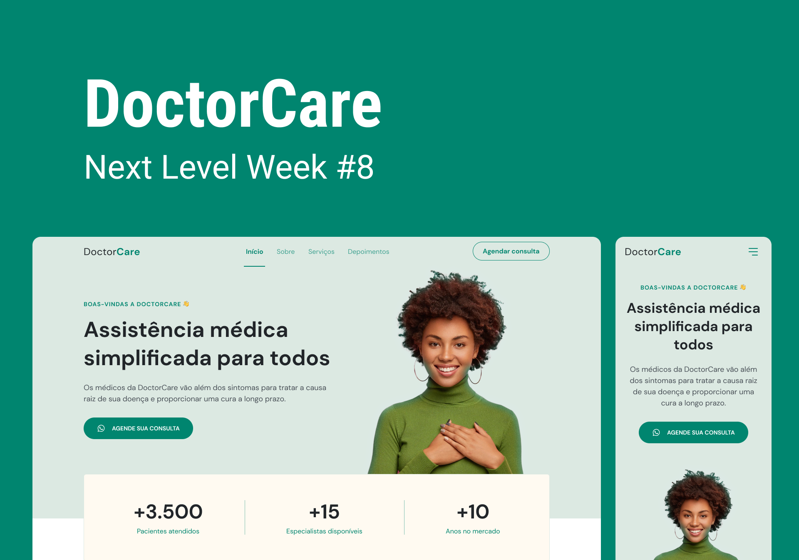

<p align="center">
  <a href="#-projeto">Projeto</a>&nbsp;&nbsp;&nbsp;|&nbsp;&nbsp;&nbsp;
  <a href="#-tecnologias">Tecnologias</a>&nbsp;&nbsp;&nbsp;|&nbsp;&nbsp;&nbsp;  
  <a href="#-layout">Layout</a>&nbsp;&nbsp;&nbsp;|&nbsp;&nbsp;&nbsp;  
  <a href="#-rodar-aplicação">Rodar aplicação</a>&nbsp;&nbsp;&nbsp;|&nbsp;&nbsp;&nbsp;
</p>

<br>

<p align="center">
  
</p>

### 💻 Projeto

Mais um projeto sensacional da [Rocketseat](https://rocketseat.com.br/) executado durante a semana <b>NLW RETURN - TRILHA ORIGIN.</b>

<b>DoctorCare</b> é uma página institucional no estilo Landing Page, desenvolvida com o conceito de mobile first. 

### 🚀 Tecnologias

Esse projeto foi desenvolvido com as seguintes tecnologias:

- HTML
- CSS
- JavaScript

Utilitários:

- [ScrollReveal](https://scrollrevealjs.org/)


### 🔖 Layout

Você pode visualizar o layout do projeto através [desse link](https://www.figma.com/community/file/1102912263666619803/DoctorCare). É necessário ter conta no [Figma](https://figma.com) para acessá-lo.


### 🎮 Rodar aplicação

```bash

# Clone este repositório

# Acesse as pastas do projeto

# Abra o arquivo index.html ou utlize a extensão live server para rodar no VsCode

```